> Visualizza le repository per [clienti](https://github.com/francescotorregrossa/ifamuzza-client), [ristoranti](https://github.com/francescotorregrossa/ifamuzza-restaurant) e [server](https://github.com/francescotorregrossa/ifamuzza-server) su GitHub.


## Introduzione

**iFamuzza** è un applicativo software distribuito, basato sull'architettura **client-server**, che ha lo scopo di mettere in comunicazione i **ristoranti** con i loro **clienti**, permettendo loro di ordinare delle portate da remoto. Gli utenti inoltre hanno la possibilità di scegliere se farsi consegnare l'ordine o se consumarlo nella struttura selezionata.

Il **team di sviluppo** è composto da cinque membri ed agirà secondo la metodologia **agile scrum**.

- Francesco Torregrossa (scrum master), junior backend developer
- Salvatore Oliveri, junior frontend developer
- Davide Avellone, junior frontend developer
- Michele Sanfilippo, junior backend developer
- Luca D'Arrigo Reitano, junior Java developer


## Analisi dei requisiti

Questo progetto ci è stato assegnato a metà ottobre 2019, esposto in un documento fornito dal cliente. Nei giorni successivi all'assegnazione abbiamo discusso le richieste tra di noi, iniziando a stipulare la lista dei requisiti funzionali e non funzionali, documentando le azioni giornaliere in un **diario**. Abbiamo inoltre contattato il cliente per chiedere delle delucidazioni e degli approfondimenti riguardanti alcuni aspetti del software. Dopo l'analisi, abbiamo riassunto i **requisiti funzionali utente** tramite la seguente lista:

* I clienti e i locali devono essere in grado di registrarsi e di fare l'accesso tramite email e password
* I clienti devono anche indicare i propri dati (metodo di pagamento, indirizzo, …) prima di fare un ordine
* I clienti anche non registrati devono essere in grado di cercare i locali aperti nelle loro vicinanze
* I clienti registrati devono poter ricevere offerte personalizzate
* I clienti devono poter vedere i menù fissi e giornalieri dei ristoranti, anche di quelli non aperti
* I clienti devono poter comporre un ordine scegliendo portate da vari locali
* I clienti devono poter visualizzare la lista degli ordini già effettuati
* I locali devono poter visualizzare la lista degli ordini ricevuti disposti per orario di consegna richiesto
* I locali devono poter modificare i propri menù sia fissi che giornalieri, e hanno anche la possibilità di segnalare la mancanza di una pietanza
* I locali devono inserire i propri dati in fase di registrazione (orari e giorni di apertura, posizione, …) ma sarà possibile modificarli in seguito

Partendo da questi, abbiamo descritto i **requisiti funzionali di sistema** che completano il quadro, aggiungendo informazioni necessarie per l'implementazione, quali i dati di input e i possibili esiti, sia positivi che negativi.

Successivamente è stato necessario anche individuare i **requisiti non funzionali** che il prodotto software dovrà rispettare, come ad esempio le normative sulla privacy in vigore in Europa. Abbiamo anche determinato alcuni fattori ambientali su cui il software non può influire, come l'attesa per la preparazione o per il trasporto degli ordini.


## Storie utente e product backlog

Una volta chiariti i requisiti, ci siamo dedicati alla **raccolta delle storie utente**, nelle quali sono stati evidenziati gli aspetti più importanti che utenti e ristoratori necessitano. Il backlog iniziale pertanto è il seguente, nel quale abbiamo determinato la priorità delle singole storie utente, ovvero l'ordine di implementazione delle funzionalità, e il livello di difficoltà di ciascuna tramite gli Story Points, decisi democraticamente da tutti i membri del team.

| ID   | SP   | Item                                                         |
| ---- | ---- | ------------------------------------------------------------ |
| 1    | 2    | As a new user I want to sign up so that I can place orders frequently and quickly. |
| 2    | 2    | As the owner of a restaurant I want to sign up so that I can reach more clients and increase the sales. |
| 3    | 4    | As a user I want to see the nearest restaurants so that I can reach one of them in case I want to eat there. |
| 4    | 3    | As the owner of a restaurant I want to update my daily menu so that I can provide fresh food and offers to my clients. |
| 5    | 2    | As the owner of a restaurant I want to update my menus in case something isn't available for a period of time. |
| 6    | 5    | As a user I want to place orders from different restaurants nearby each other. |
| 7    | 1    | As a registered user I want to be able to change my data before placing an order so that I can order wherever I am. |
| 8    | 2    | As the owner of a restaurant I want to see the orders that I've received in the past so that I can see what my clients like the most. |
| 9    | 1    | As the owner of a restaurant I want to see the orders that I've received today, sorted by delivery time, so that I can prepare them. |
| 10   | 1    | As the owner of a restaurant I want to be able to manually confirm or decline an order so that I can prevent issues in case something isn't available. |
| 11   | 1    | As a registered user I want to see all the orders that I have placed so that I can repeat one of them. |
| 12   | 5    | As a new user I want to sign up so that I can receive promotions tailored to my habits. |
| 13   | 3    | As a user I want to be able to log out and delete the data that I've generated so that I can secure my privacy. |


## Architettura e tecnologie usate

<p align="center"></p>

Dopo aver preparato il backlog iniziale ci siamo dedicati alla scelta dell'architettura da utilizzare. In base al lavoro da fare e in base alle competenze prima descritte dei membri del team, abbiamo deciso di lavorare a tre programmi distinti:

- un **server** web, sviluppato con **SpringBoot** e **MySQL**, che fornisca tutte le API necessarie per la gestione degli utenti (registrazione, accesso, modifica dei dati), della ricerca dei locali e della gestione degli ordini
- un **client** per **iOS** e **Android** dedicato ai clienti, sviluppato con **React Native**, che fornisca un'interfaccia gradevole e facilmente accessibile e che interagisca col server inviandogli le azioni degli utenti e mostrando i risultati
- un **client** per **Windows**, **Mac** e **Linux** dedicato ai ristoratori, sviluppato con **Java**, che fornisca un'interfaccia funzionale e che interagisca col server per accedere agli ordini dei clienti

Tutti e tre i software comunicheranno tramite protocollo **HTTPS** e si scambieranno i dati tramite lo standard **JSON**. Inoltre, per poter lavorare contemporaneamente e in remoto utilizzeremo tre repository su **GitHub**.

Di seguito riportiamo gli schemi delle architetture **Model-View-Controller** che abbiamo seguito per implementare i due client.

<p align="center"></p>


<p align="center"></p>

Per entrambe le interfacce abbiamo deciso di usare il modello MVC così da separare logicamente la comunicazione col server dalla visualizzazione dei dati e dall'interazione con essi. Così facendo, anche se i software sono implementati con linguaggi diversi, non è stato difficile adattare il modello scelto ad entrambi i casi.


## Primo sprint

### Backlog all'inizio del primo sprint

Abbiamo dedicato la prima riunione dello sprint all'approfondimento delle prime due storie utente, suddividendole in **task**. Abbiamo anche stimato le ore di sviluppo da dedicare a ciascuno di essi.

| ID   | Item                                                         | Comments | Planned Hours | 1    | 2    | 3    | 4    | 5    | 6    | 7    | 8    | 9    | 10   |
| ---- | ------------------------------------------------------------ | -------- | ------------- | ---- | ---- | ---- | ---- | ---- | ---- | ---- | ---- | ---- | ---- |
| 1    | **As a new user I want to sign up so that I can place orders frequently and quickly.** |          |               |      |      |      |      |      |      |      |      |      |      |
|      | Create database table for customer authentication            |          | 1             |      |      |      |      |      |      |      |      |      |      |
|      | Create server side model for customers                       |          | 2             |      |      |      |      |      |      |      |      |      |      |
|      | Create client side (react) model for customers               |          | 2             |      |      |      |      |      |      |      |      |      |      |
|      | Create client side (java) model for customers                |          | 2             |      |      |      |      |      |      |      |      |      |      |
|      | Create customer home page                                    |          | 2             |      |      |      |      |      |      |      |      |      |      |
|      | Create sign up page (react)                                  |          | 2             |      |      |      |      |      |      |      |      |      |      |
|      | Create login page (react)                                    |          | 1             |      |      |      |      |      |      |      |      |      |      |
|      | Create server verification for client login                  |          | 3             |      |      |      |      |      |      |      |      |      |      |
|      | Create server verification for client signup                 |          | 3             |      |      |      |      |      |      |      |      |      |      |
|      | Manual test for login                                        |          | 3             |      |      |      |      |      |      |      |      |      |      |
|      | Manual test for signup                                       |          | 4             |      |      |      |      |      |      |      |      |      |      |
| 2    | **As the owner of a restaurant I want to sign up so that I can reach more clients and increase the sales.** |          |               |      |      |      |      |      |      |      |      |      |      |
|      | Create database table for restaurant authentication          |          | 1             |      |      |      |      |      |      |      |      |      |      |
|      | Create server side model for restaurants                     |          | 2             |      |      |      |      |      |      |      |      |      |      |
|      | Create client side (react) model for restaurants             |          | 2             |      |      |      |      |      |      |      |      |      |      |
|      | Create client side (java) model for restaurants              |          | 2             |      |      |      |      |      |      |      |      |      |      |
|      | Create restaurant dashboard                                  |          | 2             |      |      |      |      |      |      |      |      |      |      |
|      | Create sign up page (java)                                   |          | 2             |      |      |      |      |      |      |      |      |      |      |
|      | Create login page (java)                                     |          | 1             |      |      |      |      |      |      |      |      |      |      |
|      | Create server verification for restaurant login              |          | 3             |      |      |      |      |      |      |      |      |      |      |
|      | Create server verification for restaurant signup             |          | 3             |      |      |      |      |      |      |      |      |      |      |
|      | Manual test for login                                        |          | 3             |      |      |      |      |      |      |      |      |      |      |
|      | Manual test for signup                                       |          | 4             |      |      |      |      |      |      |      |      |      |      |


### UML e design pattern

Sempre nella prima riunione abbiamo deciso il modello da seguire per l'implementazione, con eventuali design pattern. Questo ci ha aiutati a suddividere il lavoro e a procedere in parallelo sui tre progetti, assicurandoci la compatibilità delle informazioni tra di essi.


<p align="center">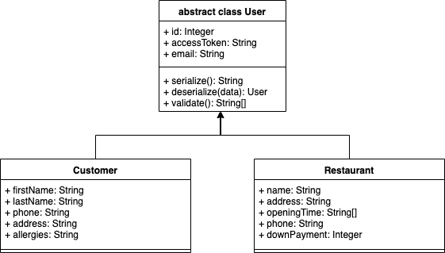</p>


Abbiamo iniziato a descrivere il modello partendo dagli utenti. Tutti gli utenti condividono le caratteristiche della classe astratta. Abbiamo predisposto un `accessToken` che sarà incluso in ogni richiesta degli utenti verso il server, in modo che esso sappia riconoscerli senza la necessità che essi facciano l'accesso ogni volta. Inoltre i metodi `serialize` e `deserialize` servono per la comunicazione in JSON col server. Infine, il metodo `validate` permette di sapere se i dati attualmente conservati nell'istanza rispettano le regole stabilite. Se ciò non dovesse accadere, il metodo restituirà una lista di errori. Il metodo tiene anche conto del fatto che gli attributi di `Restaurant` sono tutti obbligatori, mentre quelli di `Customer` sono opzionali.


<p align="center">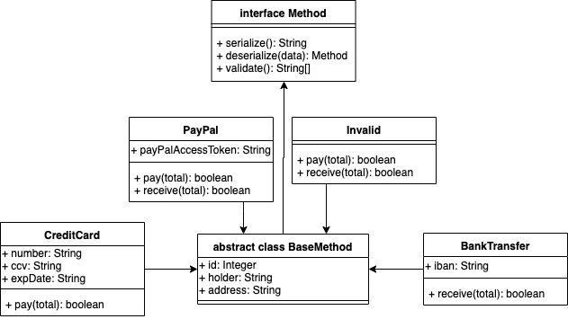</p>


Successivamente, è stato necessario specificare la struttura dei metodi di pagamento e di ricezione di denaro da parte delle strutture. Per iniziare abbiamo definito una classe `BaseMethod` che fornisce metodi e informazioni comuni a tutti i metodi di pagamento, ovvero `holder` (intestatario), e `address` (indirizzo di fatturazione), e i metodi dell'interfaccia, `serialize`, `deserialize`  e `validate`, che seguono la stessa logica di quelli di `User`. Abbiamo anche creato un metodo `Invalid` il cui unico scopo è quello di far fallire la procedura `validate`.


<p align="center">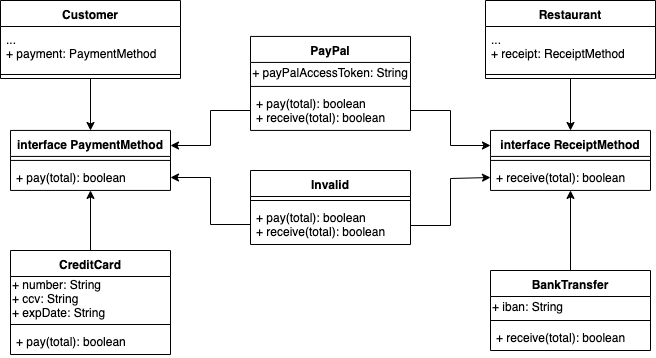</p>


Per permettere ai `Customer` di utilizzare soltanto metodi di pagamento, e non di ricezione (e viceversa ai `Restaurant`), abbiamo introdotto due interfacce: `PaymentMethod` e `ReceiptMethod`, che introducono rispettivamente i metodi `pay` e `receive`. Così facendo è stato possibile assegnare a ciascun metodo solo le funzioni supportate da esso. È possibile adottare il design pattern **strategy**, tra `Customer` e `PaymentMethod` e anche tra `Restaurant` e `ReceiptMethod`, poiché la differenza tra i vari metodi sta solo nell'algoritmo usato.


<p align="center">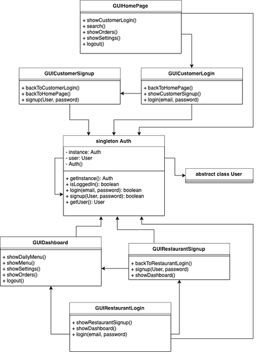</p>


Infine, abbiamo realizzato un **singleton** `Auth`, la cui unica istanza può essere raggiunta da tutte le classi. Questo permette di controllare l'accesso e la registrazione di clienti e ristoranti mediante l'invio e la ricezione di richieste HTTPS. Inoltre, abbiamo creato le interfacce `GUICustomerSignup`, `GUICustomerLogin`,  `GUIRestaurantSignup` e `GUIRestaurantLogin` per richiedere agli utenti le informazioni necessarie per il completamento di queste azioni. La pagina iniziale da mostrare ai clienti è `GUIHomePage`, che permetterà, oltre che a raggiungere le funzionalità di accesso e registrazione, di effettuare la ricerca dei ristoranti, anche ai clienti non registrati. Per quanto riguarda i ristoranti, invece, una volta fatto il login o il signup, avranno accesso alla `GUIDashboard` in cui potranno effettuare le operazioni stabilite.


### Test di sviluppo

Una parte fondamentale dell'implementazione dei metodi e delle classi descritte è stata la parte dei test. Utilizzando **JUnit** e **SpringBootTest** abbiamo eseguito i **test unitari** e i **test dei componenti** sull'API di login, testando anche il metodo `serialize`. Per farlo, abbiamo creato degli utenti fittizi tramite oggetti **mock**, e abbiamo provato ad effettuare l'accesso usando credenziali corrette ed errate. Nel primo caso abbiamo anche utilizzato la funzione `assertEquals` per verificare che  `serialize` si comportasse nel modo atteso. Nell'esempio seguente abbiamo testato le API di accesso per i clienti, che si trova all'indirizzo `/api/customerLogin`, con metodo POST. Il primo test ha avuto successo perché le credenziali sono corrette, mentre nel secondo caso la password inserita non corrisponde a quella dell'utente.

```java
@Test
void positiveCustomerLoginTest() throws Exception {
  ObjectMapper mapper = new ObjectMapper();
  ObjectNode node = mapper.createObjectNode();
  node.put("email", "prova@gmail.com");
  node.put("password", "Maiuscola1Numero");  // usiamo la password corretta
  String jsonRequest = new ObjectMapper().writerWithDefaultPrettyPrinter().writeValueAsString(node);

  Customer c = new Customer();
  // configura oggetto mock ...

  String response = this.mock.perform(post("/api/customerLogin")
                                      .contentType(MediaType.APPLICATION_JSON).content(jsonRequest))
    .andDo(print()).andExpect(status().isOk())
    .andReturn().getResponse().getContentAsString();

  JsonNode responseJson = mapper.readTree(response);  // JSON ricevuto
  JsonNode expectedJson = c.serialize();  // JSON atteso, test di serialize
  assertEquals(expectedJson, responseJson);
}

@Test
void negativeCustomerLoginTest() throws Exception {
  ObjectMapper mapper = new ObjectMapper();
  ObjectNode node = mapper.createObjectNode();
  node.put("email", "prova@gmail.com");
  node.put("password", "abc");  // usiamo la password sbagliata
  String json = new ObjectMapper().writerWithDefaultPrettyPrinter().writeValueAsString(node);

  this.mock.perform(post("/api/customerLogin")
                    .contentType(MediaType.APPLICATION_JSON).content(json))
    .andDo(print()).andExpect(status().isBadRequest())
    .andExpect(content().string(""));  // controlla che la risposta sia è vuota
}
```


### Backlog alla fine del primo sprint

| ID   | Item                                                         | Comments                                                     | Planned Hours | 1    | 2    | 3    | 4    | 5    | 6    | 7    | 8    | 9    | 10   |
| ---- | ------------------------------------------------------------ | ------------------------------------------------------------ | ------------- | ---- | ---- | ---- | ---- | ---- | ---- | ---- | ---- | ---- | ---- |
| 1    | **As a new user I want to sign up so that I can place orders frequently and quickly.** |                                                              |               |      |      |      |      |      |      |      |      |      |      |
|      | Create database table for customer authentication            | Use SpringBoot's `@Entity` to create the tables              | 1             | X    |      |      |      |      |      |      |      |      |      |
|      | Create server side model for customers                       |                                                              | 2             | X    | X    | X    |      |      |      |      |      |      |      |
|      | Create client side (react) model for customers               |                                                              | 2             | X    | X    | X    |      |      |      |      |      |      |      |
|      | Create client side (java) model for customers                |                                                              | 2             |      |      |      | X    | X    |      |      |      |      |      |
|      | Create customer home page                                    |                                                              | 2             |      |      |      | X    | X    | X    |      |      |      |      |
|      | Create sign up page (react)                                  | `serialize`                                                  | 2             |      |      |      |      |      |      |      |      |      |      |
|      | Create login page (react)                                    | `deserialize`                                                | 1             |      |      |      |      |      |      | X    | X    | X    | X    |
|      | Create server verification for client login                  | `validate`, `serialize`                                      | 3             |      |      |      |      |      |      | X    | X    |      |      |
|      | Create server verification for client signup                 | `validate`, `deserialize`                                    | 3             |      |      |      |      |      |      |      |      |      |      |
|      | Manual test for login                                        | Verify that only pairs of correct email/password are accepted, and that user data is sent correctly. | 3             |      |      |      |      |      |      | X    | X    |      |      |
|      | Manual test for signup                                       | Verify the validity of the received data.                    | 4             |      |      |      |      |      |      |      |      |      |      |
| 2    | **As the owner of a restaurant I want to sign up so that I can reach more clients and increase the sales.** |                                                              |               |      |      |      |      |      |      |      |      |      |      |
|      | Create database table for restaurant authentication          | Use SpringBoot's `@Entity` to create the tables              | 1             | X    |      |      |      |      |      |      |      |      |      |
|      | Create server side model for restaurants                     |                                                              | 2             | X    | X    | X    |      |      |      |      |      |      |      |
|      | Create client side (react) model for restaurants             |                                                              | 2             | X    | X    | X    |      |      |      |      |      |      |      |
|      | Create client side (java) model for restaurants              |                                                              | 2             |      |      |      |      | X    | X    |      |      |      |      |
|      | Create restaurant dashboard                                  |                                                              | 2             |      |      |      | X    | X    | X    |      |      |      |      |
|      | Create sign up page (java)                                   | `serialize`                                                  | 2             |      |      |      |      |      |      |      |      |      |      |
|      | Create login page (java)                                     | `deserialize`                                                | 1             |      |      |      |      |      |      | X    | X    | X    | X    |
|      | Create server verification for restaurant login              | `validate`, `serialize`                                      | 3             |      |      |      |      |      |      |      |      | X    | X    |
|      | Create server verification for restaurant signup             | `validate`, `deserialize`                                    | 3             |      |      |      |      |      |      |      |      |      |      |
|      | Manual test for login                                        | Verify that only pairs of correct email/password are accepted, and that user data is sent correctly. | 3             |      |      |      |      |      |      |      |      | X    | X    |
|      | Manual test for signup                                       | Verify the validity of the received data.                    | 4             |      |      |      |      |      |      |      |      |      |      |


### Risultato

<p align="center">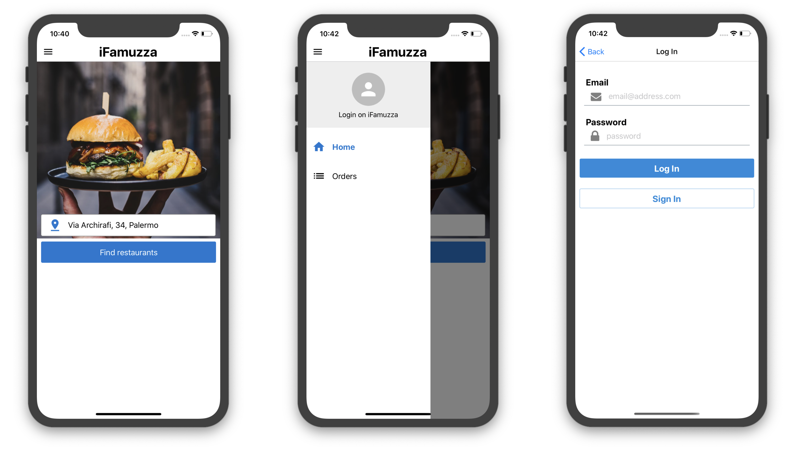</p>

A sinistra e al centro si vede la `GUIHomePage`, che permette di accedere a `GUICustomerLogin`, mostrata a destra.


<p align="center">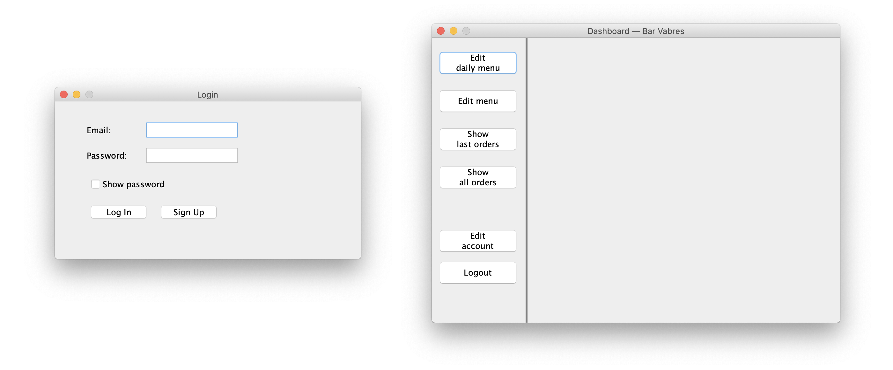</p>

A sinistra si vede la `GUIRestaurantLogin`, che permette di accedere a `GUIDashboard`, mostrata a destra, attualmente vuota.


## Secondo sprint

Dal momento che non siamo riusciti a completare nel primo sprint la parte di registrazione, e dato anche che si avvicinavano le festività natalizie, abbiamo deciso di organizzare il secondo sprint in modo da completare i task rimasti. Abbiamo però deciso di aggiungere la schermata di modifica delle informazioni del profilo.


### Cambiamenti nei requisiti

Ci è stato richiesto di modificare la gestione dei pagamenti, facendo in modo che in un singolo ordine che comprende diversi ristoranti non si debba più pagare separatamente, ma che sarà il sistema a partizionare un unico pagamento del cliente a tutti i ristoranti coinvolti. Nel primo sprint abbiamo   implementato i metodi di pagamento, ma dal momento che non abbiamo ancora progettato la gestione degli ordini, i metodi non sono attualmente utilizzati e di conseguenza non è stato necessario effettuare alcun cambiamento.

Durante il secondo sprint il cliente ci ha contattati un'altra volta, chiedendoci di modificare la gestione dei menù giornalieri. Adesso il ristorante deve scegliere i menù giornalieri utilizzando come base le portate già scritte nel menù fisso. Anche in questo caso, però, non è stato necessario modificare il modello attuale perché la gestione di menù e di ordini è stata riservata ad uno sprint successivo.


### UML e design pattern

<p align="center">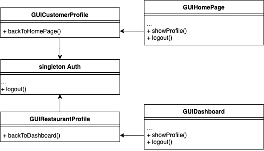</p>

Abbiamo creato una schermata per visualizzare e modificare il profilo dei clienti e una per i ristoranti. Entrambe prendono i dati dal singleton Auth e sono raggiungibili dalle rispettive schermate principali.


### Test di sviluppo

Anche alla fine del secondo sprint abbiamo provato che le funzioni scritte si comportassero nella maniera attesa. Abbiamo eseguito test unitari e dei componenti sull'API della registrazione, in particolare provando la correttezza della funzione  `validate`. Sempre usando oggetti mock, abbiamo inserito alcuni dati corretti e altri in formato errato, e abbiamo utilizzato `assertArrayEquals` per verificare che il risultato di `validate` producesse l'array di errori atteso. Nell'esempio seguente entrambi i test hanno avuto successo perché nel primo caso non ci sono errori, mentre nel secondo caso l'email inserita non è valida e i dati sugli orari di apertura non rispettano la nostra scelta sul formato.

```java
@Test
void validateTests() {
  Restaurant[] restaurants = new Restaurant[2];
  for (int i = 0; i < restaurants.length; i++) {
    restaurants[i] = new Restaurant();
  }

  restaurants[0].setEmail("savoca@libero.com");
  restaurants[1].setEmail("newparadise@it");  // errato
  restaurants[0].setOpeningTime(new String[]{"mon 11:30-18:30", "fri 10:30-19:30"});
  restaurants[1].setOpeningTime(new String[]{"sat11:30-18:30", "sun10:30-19:30"}); // errato
  // configura oggetti mock ...
 	
  BankTransfer p0 = new BankTransfer();
  p0.setHolder("Mario Rossi");
  p0.setAddress("Via Montepellegrino, 90100, Palermo");
  p0.setIBAN("IT92B0300203280436737196943");
  restaurants[0].setReceiptMethod(p0);  // test dei componenti
  // ...
  
  assertArrayEquals(new String[] { }, restaurants[0].validate());
  assertArrayEquals(new String[] {"email", "openingTime"}, restaurants[1].validate());
}
```


### Backlog alla fine del secondo sprint

| ID   | Item                                                         | Comments                                  | Planned Hours | 1    | 2    | 3    | 4    | 5    | 6    | 7    | 8    | 9    | 10   |
| ---- | ------------------------------------------------------------ | ----------------------------------------- | ------------- | ---- | ---- | ---- | ---- | ---- | ---- | ---- | ---- | ---- | ---- |
| 1    | **As a new user I want to sign up so that I can place orders frequently and quickly.** |                                           |               |      |      |      |      |      |      |      |      |      |      |
|      | Create sign up page (react)                                  | `serialize`                               | 3             |      |      |      |      |      | X    | X    | X    |      |      |
|      | Create profile page (react)                                  |                                           | 2             |      |      |      |      |      |      |      |      | X    | X    |
|      | Create server verification for client signup                 | `validate`, `deserialize`                 | 3             | X    | X    | X    |      |      |      |      |      |      |      |
|      | Create log out button (react)                                |                                           | 1             |      |      |      |      |      |      |      |      |      |      |
|      | Manual test for signup                                       | Verify the validity of the received data. | 2             |      |      |      | X    | X    |      |      |      |      |      |
| 2    | **As the owner of a restaurant I want to sign up so that I can reach more clients and increase the sales.** |                                           |               |      |      |      |      |      |      |      |      |      |      |
|      | Create sign up page (java)                                   | `serialize`                               | 3             |      |      |      |      |      | X    | X    | X    |      |      |
|      | Create profile page (java)                                   |                                           | 2             |      |      |      |      |      |      |      |      | X    | X    |
|      | Create server verification for restaurant signup             | `validate`, `deserialize`                 | 3             | X    | X    | X    |      |      |      |      |      |      |      |
|      | Create log out button (java)                                 |                                           | 1             |      |      |      |      |      |      |      |      |      |      |
|      | Manual test for signup                                       | Verify the validity of the received data. | 2             |      |      |      | X    | X    |      |      |      |      |      |


### Risultato

<p align="center">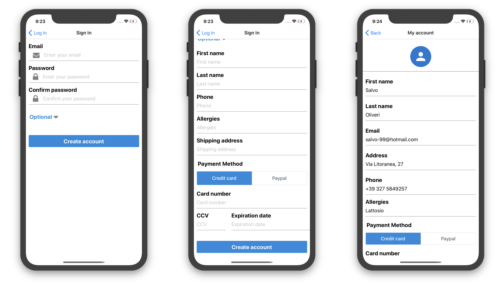</p>

Questa è la `GUICustomerSignup`, accessibile da `GUICustomerLogin`, caratterizzata dal fatto che quasi tutti i dati sono opzionali.


<p align="center">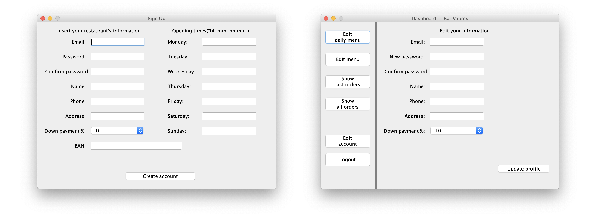</p>

A sinistra si vede la `GUIRestaurantSignup`, accessibile da `GUIRestaurantLogin`. A destra invece c'è la `GUIRestaurantProfile`, accessibile dalla dashboard una volta loggati, che permette di vedere e modificare i dati inseriti.


## Terzo sprint

Abbiamo finito i task dello sprint precedente implementando la funzione di logout su entrambi i client.


### UML e design pattern


<p align="center">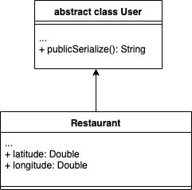</p>

Abbiamo introdotto sul server due versioni della serializzazione: `serialize` e `publicSerialize`. La prima fornisce più informazioni della seconda, ed è utilizzata durante il login, in quanto un utente che effettua l'accesso riceverà tutti i suoi dati. La seconda invece riguarda l'interazione tra clienti e ristoranti, poiché include solamente i dati che devono essere pubblicamente visibili. Per esempio, quando un cliente effettua una ricerca, il server tralascerà i dati privati dei ristoranti, come quelli di pagamento. 

Per permettere agli utenti di eseguire la ricerca dei locali vicini a loro, abbiamo pensato di lavorare sulle coordinate e calcolare la distanza in linea d'aria. Secondo le richieste del cliente, la distanza non deve superare i 10 km. Abbiamo utilizzato delle API di terze parti per eseguire l'operazione di **geocoding**, ovvero la conversione di un indirizzo in coordinate e viceversa. Il servizio è **OpenCage**, che offre delle librerie sia per Java che per React-Native. Per velocizzare l'elaborazione delle richieste e per evitare di effettuare troppe chiamate al servizio esterno, abbiamo anche deciso di memorizzare `latitude` e `longitiude` dei ristoranti nel nostro database.


### Test di sviluppo

Alla fine del terzo sprint abbiamo deciso di eseguire dei **test di integrazione**, che abbiamo svolto avviando tutti e tre i software e provando ad effettuare le operazioni implementate. Abbiamo dunque eseguito la registrazione, il login e il logout per un ristorante e per un cliente, utilizzando le due rispettive interfacce, e infine abbiamo provato ad eseguire la ricerca sia da un utente loggato che con un utente non loggato.


### Backlog alla fine del terzo sprint

| ID   | Item                                                         | Comments              | Planned Hours | 1    | 2    | 3    | 4    | 5    | 6    | 7    | 8    | 9    | 10   |
| ---- | ------------------------------------------------------------ | --------------------- | ------------- | ---- | ---- | ---- | ---- | ---- | ---- | ---- | ---- | ---- | ---- |
| 1    | **As a new user I want to sign up so that I can place orders frequently and quickly.** |                       |               |      |      |      |      |      |      |      |      |      |      |
|      | Create log out button (react)                                |                       | 1             |      |      |      |      |      |      |      | X    |      |      |
| 2    | **As the owner of a restaurant I want to sign up so that I can reach more clients and increase the sales.** |                       |               |      |      |      |      |      |      |      |      |      |      |
|      | Create log out button (java)                                 |                       | 1             |      |      |      |      |      |      |      | X    |      |      |
| 3    | **As a user I want to see the nearest restaurants so that I can reach one of them in case I want to eat there.** |                       |               |      |      |      |      |      |      |      |      |      |      |
|      | Create search page (react)                                   |                       | 2             | X    | X    | X    | X    |      |      |      |      |      |      |
|      | Get GPS coordinates (react)                                  |                       | 4             | X    | X    | X    | X    | X    |      |      |      |      |      |
|      | Convert coordinates to address (react)                       | `opencage-api-client` | 2             |      |      |      |      |      | X    | X    |      |      |      |
|      | Convert restaurant address to coordinates (server)           | `JOpenCage`           | 2             | X    | X    |      |      |      |      |      |      |      |      |
|      | Implement server side search for address                     |                       | 3             | X    | X    | X    |      |      |      |      |      |      |      |
|      | Manual test for search                                       |                       | 2             |      |      |      |      |      |      |      |      | X    | X    |


### Risultato

<p align="center">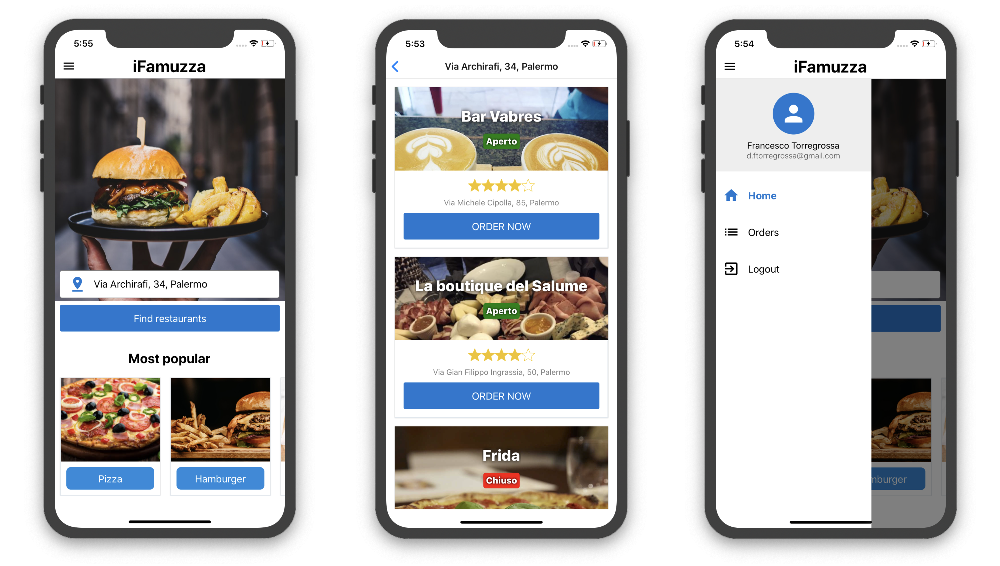</p>

A sinistra si vede la schermata home con le funzioni che saranno usate per filtrare la ricerca, al centro si vede la schermata di ricerca e a destra il menù di un utente loggato con la funzione di logout.


